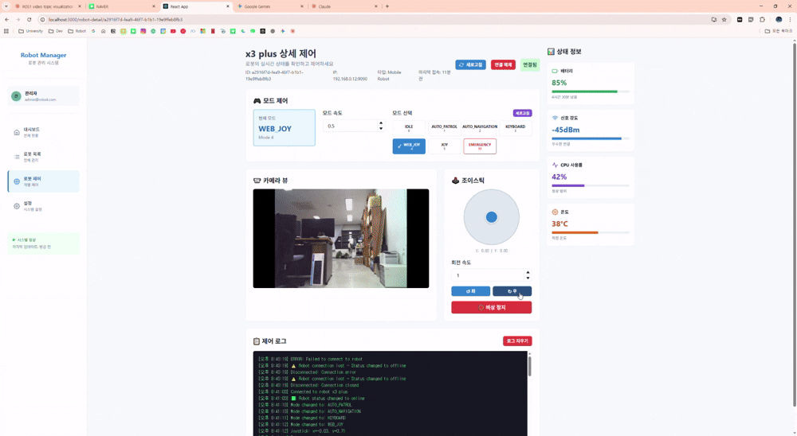

# SSU Robot Control System (RCS)

**ROS1 Melodic 기반 Yahboom Rosmaster X3 Plus 제어 시스템**

## 프로젝트 개요

숭실대학교 디지털미디어학과 로봇동아리
 Yahboom Rosmaster X3 Plus 로봇을 제어하기 위한 풀스택 로봇 제어 시스템입니다. 웹 기반 관리 인터페이스(React + NestJS)와 ROS1 기반 실시간 제어 시스템을 결합하여, 다중 로봇 관리 및 원격 제어를 지원합니다.

### 시스템 구성

이 프로젝트는 3개의 독립적인 저장소로 구성되어 있습니다:

1. **[SSU-Robot-RCS-Frontend](https://github.com/kg3546549/SSU-Robot-RCS-Frontend)**: React + TypeScript 기반 웹 대시보드
2. **[SSU-Robot-RCS-Server](https://github.com/kg3546549/SSU-Robot-RCS-Server)**: NestJS 기반 로봇 메타데이터 관리 서버
3. **SSU_ROBOT_ws** (현재 저장소): ROS1 Melodic 기반 로봇 제어 워크스페이스

### 주요 특징

- **웹 기반 로봇 관리**: 다중 로봇 등록, 상태 모니터링, 메타데이터 관리
- **실시간 원격 제어**: WebSocket 기반 웹 조이스틱으로 직접 제어
- **모듈식 모드 관리**: 7가지 동작 모드 지원 (IDLE, AUTO_PATROL, AUTO_NAVIGATION, KEYBOARD, WEB_JOY, JOY, EMERGENCY)
- **중앙 집중식 제어**: Central Node가 모드에 따라 입력 소스를 선택적으로 처리
- **자율 순찰 기능**: PID 제어 기반 벽 추종 알고리즘 구현
- **REST API + WebSocket**: 로봇 정보는 REST API, 제어는 WebSocket으로 분리
- **실시간 센서 통합**: IMU, LiDAR, Odometry 데이터 처리

### Demo


---

## 시스템 아키텍처

### 전체 시스템 구조

```
┌────────────────────────────────────────────────────────────────────────┐
│                         사용자 (User)                                    │
│                    웹 브라우저 (Web Browser)                              │
└──────────────────────┬─────────────────────────────────────────────────┘
                       │
                       ▼
┌────────────────────────────────────────────────────────────────────────┐
│              Frontend (React + TypeScript + Chakra UI)                  │
│                     http://localhost:3000                               │
│  ┌──────────────┬──────────────┬──────────────┬──────────────┐        │
│  │  Dashboard   │  Robot List  │ Control Board│   Settings   │        │
│  └──────────────┴──────────────┴──────────────┴──────────────┘        │
└──────────┬────────────────────────────────────────────┬────────────────┘
           │ REST API                                    │ WebSocket
           │ (로봇 메타데이터 조회/관리)                   │ (실시간 제어)
           ▼                                             ▼
┌────────────────────────────────────────────────────────────────────────┐
│              Backend (NestJS + MongoDB)                                 │
│                http://localhost:3001                                    │
│                                                                          │
│  ┌──────────────────────────────────────────────────────────┐          │
│  │              Robot CRUD API (REST)                        │          │
│  │  - 로봇 등록/조회/수정/삭제                                  │          │
│  │  - 상태 관리 (online/offline/error)                        │          │
│  │  - 능력 관리 (movement/sensors/camera)                     │          │
│  │  - 필터링 & 검색                                            │          │
│  └──────────────────────────────────────────────────────────┘          │
│                                                                          │
│  ┌──────────────────────────────────────────────────────────┐          │
│  │         WebSocket Gateway (1:N 로봇 제어)                 │          │
│  │  - Frontend ↔ Backend WebSocket 연결                      │          │
│  │  - Backend ↔ 다중 로봇 WebSocket 관리                      │          │
│  │  - 명령어 라우팅 (특정 로봇으로 전달)                         │          │
│  │  - 센서 데이터 중계 (로봇 → Frontend)                       │          │
│  └─────────────────────┬────────────────────────────────────┘          │
└────────────────────────┼───────────────────────────────────────────────┘
                         │
                         │ WebSocket (1:N)
         ┌───────────────┼───────────────┬───────────────┐
         │               │               │               │
         ▼               ▼               ▼               ▼
     Robot #1        Robot #2        Robot #3        Robot #N
  ws://IP1:9090   ws://IP2:9090   ws://IP3:9090   ...
         │               │               │               │
┌────────┼───────────────┼───────────────┼───────────────┼────────────────┐
│        ▼               ▼               ▼               ▼                │
│  ┌─────────────────────────────────────────────────────────┐           │
│  │            ROS Bridge WebSocket Server (:9090)           │           │
│  └───────────────────────┬─────────────────────────────────┘           │
│                          │                                              │
│  ┌───────────────────────▼────────────────────────────────┐            │
│  │                  Mode Manager Node                      │            │
│  │  - 모드 상태 관리 (RobotMode Enum)                        │            │
│  │  - ROS Service (/mode/req) 제공                         │            │
│  │  - 모드 변경 브로드캐스트 (/mode/broad)                    │            │
│  └───────────────────────┬────────────────────────────────┘            │
│                          │ Mode Broadcast                               │
│                          ▼                                              │
│  ┌──────────────────────────────────────────────────────────┐          │
│  │              Central Control Node                         │          │
│  │  - 입력 소스 라우팅 (모드별 선택적 처리)                       │          │
│  │  - 속도 명령 통합 및 발행 (/cmd_vel)                         │          │
│  │  - 긴급 정지 처리                                           │          │
│  └────┬────┬────┬────┬────┬──────────────────────────────────┘         │
│       │    │    │    │    │                                             │
│    [키보드][웹][조이][순찰][네비]                                         │
│       │    │    │    │    │                                             │
│       ▼    ▼    ▼    ▼    ▼                                             │
│  ┌──────────────────────────────────────────────────────────┐          │
│  │           Yahboom Hardware Driver Node                    │          │
│  │  - 모터 제어 (/cmd_vel 구독)                                │          │
│  │  - IMU/LiDAR 센서 데이터 발행                                │          │
│  │  - Odometry 발행                                           │          │
│  └───────────────────┬──────────────────────────────────────┘          │
│                      │                                                  │
└──────────────────────┼──────────────────────────────────────────────────┘
                       ▼
              ┌─────────────────┐
              │  Yahboom Robot  │
              │   Hardware      │
              │  (X3 Plus)      │
              └─────────────────┘
```

### 데이터 흐름

#### 1. 로봇 등록 및 관리 (REST API)
```
사용자 → Frontend → Backend REST API → MongoDB
                         ↓
                 로봇 목록 조회/등록/수정/삭제
                 (IP, 포트, 능력 등 메타데이터)
```

#### 2. 실시간 로봇 제어 (WebSocket - 1:N 구조)
```
사용자 (웹 조이스틱 조작)
    ↓
Frontend → Backend WebSocket Gateway
    ↓ (명령: {robotId: "robot1", cmd: "move", data: {...}})
Backend → 특정 로봇 WebSocket 연결 선택
    ↓ ws://robot1_ip:9090
ROS Bridge (:9090) → /web/cmd_vel 토픽 발행
    ↓
Central Control Node (모드 확인: WEB_JOY?)
    ↓
/cmd_vel 토픽 발행
    ↓
Yahboom Driver Node → 로봇 모터 제어

센서 데이터 역방향:
Robot → ROS Bridge → Backend Gateway → Frontend
(실시간 센서 데이터 스트리밍)
```

#### 3. 모드 변경 (Backend를 통한 제어)
```
Frontend → Backend WebSocket Gateway
    ↓ (명령: {robotId: "robot1", cmd: "changeMode", mode: 1})
Backend → 해당 로봇의 WebSocket 연결
    ↓
ROS Bridge → ROS Service Call (/mode/req)
    ↓
Mode Manager → 모드 변경 → /mode/broad 브로드캐스트
    ↓
Central Control Node → 현재 모드 업데이트
    ↓
응답: Backend → Frontend (모드 변경 완료 알림)
```

#### 4. 자율 순찰 (로봇 자체 동작)
```
Backend → 로봇에 AUTO_PATROL 모드 설정
    ↓
Mode Manager (AUTO_PATROL 모드 설정)
    ↓
Patrol Node → LiDAR 데이터 분석 → /patrol/cmd_vel 발행
    ↓
Central Control Node (AUTO_PATROL 모드에서만 수신)
    ↓
/cmd_vel 토픽 발행 → 로봇 이동
    ↓
센서 데이터 → Backend → Frontend (순찰 상태 모니터링)
```

#### 5. 다중 로봇 동시 제어
```
Frontend Control Board
    ↓
Backend WebSocket Gateway (연결 관리)
    ├─→ Robot #1 (ws://192.168.1.101:9090)
    ├─→ Robot #2 (ws://192.168.1.102:9090)
    ├─→ Robot #3 (ws://192.168.1.103:9090)
    └─→ Robot #N (ws://192.168.1.xxx:9090)

각 로봇에 독립적으로 명령 전송 가능
Backend가 연결 상태 관리 및 메시지 라우팅
```

---

## 패키지 구조

### 1. **mode_manager**
모드 상태 관리 및 서비스 제공

**주요 기능:**
- JSON 기반 ROS Service 인터페이스 (`/mode/req`)
- 모드 변경 브로드캐스트 (`/mode/broad`)
- 7가지 로봇 동작 모드 관리

**제공 서비스:**
```bash
# 현재 모드 조회
rosservice call /mode/req "{request_data: '{\"command\": \"get\"}'}"

# 모드 변경 (예: 자동 순찰 모드로 변경)
rosservice call /mode/req "{request_data: '{\"command\": \"set\", \"mode\": 1, \"speed\": 0.5}'}"

# 사용 가능한 모드 목록 조회
rosservice call /mode/req "{request_data: '{\"command\": \"list\"}'}"
```

**모드 정의:**
| 모드 값 | 이름 | 설명 |
|--------|------|------|
| 0 | IDLE | 대기 상태 |
| 1 | AUTO_PATROL | 자동 순찰 (벽 추종) |
| 2 | AUTO_NAVIGATION | 자동 네비게이션 |
| 3 | KEYBOARD | 키보드 제어 |
| 4 | WEB_JOY | 웹 조이스틱 제어 |
| 5 | JOY | 물리 조이스틱 제어 |
| 99 | EMERGENCY | 비상 정지 |

---

### 2. **central_control**
중앙 집중식 제어 및 입력 라우팅

**주요 기능:**
- 모드별 입력 소스 선택적 처리
- 통합 속도 명령 발행 (`/cmd_vel`)
- 긴급 정지 즉시 처리

**입력 소스:**
- `/keyboard` (String) - 키보드 키 입력
- `/web/cmd_vel` (Twist) - 웹 조이스틱 명령
- `/joy` (Joy) - 물리 조이스틱 명령
- `/patrol/cmd_vel` (Twist) - 자율 순찰 명령

**키보드 제어 키맵:**
```
    i       u       o
    ↑     ↺ ↑ ↻     ↑

j ← • → l   k   , (후진)
               ↓
```
- `i`: 전진, `,`: 후진
- `j`: 왼쪽 이동, `l`: 오른쪽 이동
- `u`: 좌회전, `o`: 우회전
- `k` / `Space`: 정지

---

### 3. **patrol_node**
자율 순찰 및 벽 추종 알고리즘

**주요 기능:**
- PID 제어 기반 벽 추종
- 상태 머신 기반 순찰 로직
- LiDAR 기반 장애물 회피

**상태 머신:**
```
INIT → FIND_WALL → FOLLOW_WALL ⇄ TURN_LEFT
                         ↓              ↓
                    TURN_RIGHT ← OBSTACLE_WAIT
```

**PID 파라미터:**
- Kp: 1.0 (비례 게인)
- Ki: 0.05 (적분 게인)
- Kd: 0.3 (미분 게인)
- 목표 벽 거리: 0.5m
- 전진 속도: 0.2 m/s

**알고리즘 특징:**
1. **벽 추종**: 우측 벽과 일정 거리 유지하며 전진
2. **장애물 회피**: 전방 장애물 감지 시 2초 대기 후 좌회전
3. **모퉁이 감지**: 우측 빈 공간 감지 시 우회전
4. **적응형 회전**: 센서 데이터 기반 회전 각도 자동 조정

---

### 4. **keyboard_control**
키보드 입력 수신 및 발행

**주요 기능:**
- 논블로킹 키 입력 처리
- `/keyboard` 토픽으로 키 발행
- Terminal raw 모드 설정/복원

---

### 5. **yahboomcar_bringup**
Yahboom 로봇 하드웨어 인터페이스

**주요 기능:**
- 로봇 하드웨어 드라이버 (Rosmaster X3 Plus)
- IMU, Odometry, 모터 제어
- 센서 데이터 발행 (LiDAR, IMU)

---

### 6. **common**
공통 라이브러리 및 유틸리티

**제공 모듈:**
- `modes.py`: RobotMode Enum 정의 및 유틸리티 함수
- `constants.py`: Topic/Service 이름 상수
- `utils.py`: JSON 응답 생성 등 공통 함수

---

## 설치 및 실행

### 시스템 요구사항

#### 로봇 (ROS System)
- Ubuntu 18.04 (Bionic)
- ROS1 Melodic
- Python 3.6+
- [Yahboom Rosmaster X3 Plus](https://www.yahboom.net/study/ROSMASTER-X3-PLUS)

#### 개발 PC (Backend & Frontend)
- Node.js 16+ (npm 또는 yarn)
- MongoDB 4.4+
- 최신 웹 브라우저 (Chrome, Firefox 등)

---

### 설치 가이드

#### 1. Backend Server (NestJS) 설치

```bash
# 저장소 클론
git clone https://github.com/kg3546549/SSU-Robot-RCS-Server.git
cd SSU-Robot-RCS-Server

# 의존성 설치
npm install

# MongoDB 실행 (별도 터미널)
# Docker 사용:
docker run -d -p 27017:27017 --name mongodb mongo:latest
# 또는 로컬 MongoDB:
mongod

# 개발 서버 실행
npm run start:dev
# 서버가 http://localhost:3001 에서 실행됨
```

**주요 API 엔드포인트:**
- `GET /robots` - 로봇 목록 조회
- `POST /robots` - 새 로봇 등록
- `GET /robots/:id` - 특정 로봇 정보 조회
- `PATCH /robots/:id` - 로봇 정보 수정
- `PUT /robots/:id/status` - 로봇 상태 업데이트
- `DELETE /robots/:id` - 로봇 삭제

#### 2. Frontend (React) 설치

```bash
# 저장소 클론
git clone https://github.com/kg3546549/SSU-Robot-RCS-Frontend.git
cd SSU-Robot-RCS-Frontend

# 의존성 설치
npm install

# 개발 서버 실행
npm start
# 서버가 http://localhost:3000 에서 실행됨
# 브라우저가 자동으로 열림
```

**Frontend 페이지 구성:**
- Dashboard: 로봇 상태 개요
- Robot List: 등록된 로봇 목록
- Control Board: 로봇 제어 인터페이스 (조이스틱)
- Settings: 설정 페이지

#### 3. ROS Workspace (로봇) 설치

```bash
# 저장소 클론
git clone https://github.com/kg3546549/SSU_ROBOT_ws.git>
cd SSU_ROBOT_ws

# ROS Melodic 설치 (Ubuntu 18.04, 로봇에서 실행)
sudo apt update
sudo apt install ros-melodic-desktop-full

# 필수 패키지 설치
sudo apt install python3-rosdep python3-rosinstall python3-rosinstall-generator python3-wstool build-essential
sudo apt install ros-melodic-rosbridge-server
sudo apt install ros-melodic-robot-state-publisher
sudo apt install ros-melodic-joint-state-publisher

# rosdep 초기화
sudo rosdep init
rosdep update

# 워크스페이스 빌드
cd ~/SSU_ROBOT_ws
catkin_make -DPYTHON_EXECUTABLE=/usr/bin/python3
source devel/setup.bash

# .bashrc에 자동 소싱 추가 (선택)
echo "source ~/SSU_ROBOT_ws/devel/setup.bash" >> ~/.bashrc
```

---

### 실행 방법

#### 전체 시스템 실행 순서

**1단계: Backend Server 실행 (개발 PC)**
```bash
cd SSU-Robot-RCS-Server
npm run start:dev
# http://localhost:3001 에서 실행 중
```

**2단계: Frontend 실행 (개발 PC)**
```bash
cd SSU-Robot-RCS-Frontend
npm start
# http://localhost:3000 에서 실행 중
# 브라우저에서 자동으로 열림
```

**3단계: ROS System 실행 (로봇)**
```bash
# 환경 변수 설정
export ROBOT_TYPE=X3plus

# 로봇 드라이버 + 중앙 제어 + 모드 관리자 + ROS Bridge 실행
roslaunch central_control centralNode.launch

# 위 명령이 다음을 모두 실행:
# - ROS Bridge WebSocket Server (포트 9090)
# - Mode Manager Node
# - Central Control Node
```

**4단계: Frontend에서 로봇 등록**
1. 브라우저에서 http://localhost:3000 접속
2. "Robot List" 페이지로 이동
3. "Add Robot" 버튼 클릭
4. 로봇 정보 입력:
   - Name: 로봇 이름 (예: "Rosmaster-01")
   - Type: "X3plus"
   - IP Address: 로봇의 IP 주소
   - Port: 9090 (ROS Bridge 포트)
   - Status: "online"
   - Capabilities: movement, sensors, camera 등 선택
5. "Save" 버튼 클릭

**5단계: 로봇 제어**
1. "Control Board" 페이지로 이동
2. 등록한 로봇 선택
3. "Connect" 버튼 클릭 (Frontend → Backend WebSocket → 로봇 연결)
4. 웹 조이스틱으로 로봇 제어 (모든 명령은 Backend를 경유)

---

### 사용 시나리오별 실행

#### 시나리오 1: 웹 인터페이스로 원격 제어

```bash
# [로봇] ROS System 실행
export ROBOT_TYPE=X3plus
roslaunch central_control centralNode.launch

# [개발 PC] Backend 실행
cd SSU-Robot-RCS-Server && npm run start:dev

# [개발 PC] Frontend 실행
cd SSU-Robot-RCS-Frontend && npm start

# [웹 브라우저] http://localhost:3000 접속
# 1. Robot List에서 로봇 등록
# 2. Control Board에서 로봇 선택 및 연결
# 3. 웹 조이스틱으로 제어
```
#### 시나리오 2: 자율 순찰 모드

```bash
# Terminal 1: ROS System 실행
roslaunch central_control centralNode.launch

# Terminal 2: 순찰 노드 실행
rosrun patrol_node patrol_node.py

# Terminal 3: 자동 순찰 모드로 변경
rosservice call /mode/req "{request_data: '{\"command\": \"set\", \"mode\": 1, \"speed\": 0.3}'}"

# 로봇이 자동으로 벽을 따라 순찰 시작
```

#### 시나리오 3: 웹에서 모드 변경 및 제어

```bash
# 1. 전체 시스템 실행 (Backend + Frontend + ROS)
# 2. Frontend Control Board에서:
#    - 로봇 연결
#    - Mode 선택 (WEB_JOY, AUTO_PATROL 등)
#    - ROS Service 호출로 모드 변경
#    - 웹 조이스틱 또는 자동 모드 실행
```

---

### 포트 정보

| 서비스 | 포트 | 설명 |
|--------|------|------|
| Frontend (React) | 3000 | 웹 대시보드 UI |
| Backend (NestJS) | 3001 | REST API 서버 |
| MongoDB | 27017 | 데이터베이스 |
| ROS Bridge WebSocket | 9090 | 실시간 로봇 제어 |

---

## 주요 토픽 및 서비스

### 토픽

| 토픽 이름 | 타입 | 설명 |
|----------|------|------|
| `/cmd_vel` | geometry_msgs/Twist | 로봇 속도 명령 (최종 출력) |
| `/mode/broad` | std_msgs/String | 현재 모드 브로드캐스트 (JSON) |
| `/keyboard` | std_msgs/String | 키보드 키 입력 |
| `/web/cmd_vel` | geometry_msgs/Twist | 웹 조이스틱 명령 |
| `/joy` | sensor_msgs/Joy | 물리 조이스틱 명령 |
| `/patrol/cmd_vel` | geometry_msgs/Twist | 자율 순찰 명령 |
| `/scan` | sensor_msgs/LaserScan | LiDAR 스캔 데이터 |
| `/imu/imu_raw` | sensor_msgs/Imu | IMU 센서 데이터 |

### 서비스

| 서비스 이름 | 타입 | 설명 |
|-----------|------|------|
| `/mode/req` | mode_manager/ModeRequest | 모드 관리 서비스 (get/set/list) |

---

## 기술 스택

### Frontend (React)
- **React 18**: UI 컴포넌트 라이브러리
- **TypeScript**: 타입 안전성
- **Chakra UI**: 모던 UI 컴포넌트
- **React Router**: 페이지 라우팅
- **Axios**: HTTP 클라이언트
- **ROSLIB.js**: ROS WebSocket 통신

### Backend (NestJS)
- **NestJS**: 모듈식 백엔드 프레임워크
- **TypeScript**: 타입 안전성
- **MongoDB + Mongoose**: NoSQL 데이터베이스
- **Class Validator**: DTO 검증
- **RxJS**: 반응형 프로그래밍
- **Express**: HTTP 서버

### ROS & 로보틱스
- **ROS Melodic**: 로봇 운영 체제
- **Catkin**: 빌드 시스템
- **TF**: 좌표 변환
- **ROS Bridge**: WebSocket 기반 웹 인터페이스
- **Python 3**: ROS 노드 개발

### 제어 알고리즘
- **PID 제어**: 벽 추종을 위한 비례-적분-미분 제어
- **상태 머신**: 순찰 로직 구현
- **센서 융합**: LiDAR + IMU + Odometry

### 데이터베이스
- **MongoDB**: 로봇 메타데이터 저장
  - 로봇 정보 (ID, 이름, 타입, IP, 포트)
  - 상태 정보 (online/offline/error)
  - 능력 정보 (movement, sensors, camera 등)

---

## 아키텍처 설계 철학

### 1. 관심사의 분리 (Separation of Concerns)
- **Frontend**: 사용자 인터페이스 및 UX
- **Backend**: 로봇 메타데이터 관리 및 비즈니스 로직
- **ROS System**: 실시간 로봇 제어 및 센서 처리

### 2. 모듈화 (Modularity)
- 각 기능을 독립적인 ROS 패키지로 분리
- 독립적인 저장소로 프로젝트 관리 (Frontend, Backend, ROS)
- 마이크로서비스 아키텍처 원칙 적용

### 3. 단일 책임 원칙 (Single Responsibility)
- **Backend API**: 로봇 정보만 관리 (제어는 직접 WebSocket)
- **Mode Manager**: 모드 관리만 담당
- **Central Control**: 입력 라우팅만 담당
- **Patrol Node**: 순찰 알고리즘만 담당

### 4. 느슨한 결합 (Loose Coupling)
- REST API와 WebSocket으로 시스템 간 통신
- ROS 토픽과 서비스를 통한 간접 통신
- **Frontend는 로봇과 직접 통신하지 않음** - Backend Gateway가 중계
- Backend가 로봇 연결 상태 관리 및 메시지 라우팅 담당

### 5. 확장성 (Extensibility)
- 새로운 로봇 추가: Backend API에 등록만 하면 됨
- 새로운 모드 추가: RobotMode Enum에 추가하고 핸들러 구현
- 새로운 센서 추가: 독립적인 ROS 노드로 추가

### 6. 스케일링 가능성 (Scalability)
- 다중 로봇 지원: 각 로봇은 독립적인 ROS 시스템
- 중앙 집중식 관리: Backend API로 모든 로봇 정보 통합 관리

---

## 프로젝트 저장소

| 프로젝트 | 저장소 URL | 설명 |
|---------|-----------|------|
| Frontend | [SSU-Robot-RCS-Frontend](https://github.com/kg3546549/SSU-Robot-RCS-Frontend) | React + TypeScript 웹 대시보드 |
| Backend | [SSU-Robot-RCS-Server](https://github.com/kg3546549/SSU-Robot-RCS-Server) | NestJS API 서버 |
| ROS Workspace | 현재 저장소 | ROS1 제어 시스템 |

---

## 라이선스

이 프로젝트는 교육 목적으로 개발되었습니다.

---

## 참고 자료

### ROS & 로보틱스
- [ROS Melodic Documentation](http://wiki.ros.org/melodic)
- [Yahboom Rosmaster X3 Plus](http://www.yahboom.net/study/ROS-X3-plus)
- [ROS Bridge Suite](http://wiki.ros.org/rosbridge_suite)
- [PID Control Wikipedia](https://en.wikipedia.org/wiki/PID_controller)

### Frontend & Backend
- [React Documentation](https://react.dev/)
- [NestJS Documentation](https://docs.nestjs.com/)
- [Chakra UI](https://chakra-ui.com/)
- [MongoDB Documentation](https://www.mongodb.com/docs/)
- [ROSLIB.js](http://robotwebtools.org/jsdoc/roslibjs/current/)

---

## 스크린샷

### Frontend 웹 대시보드
> 추후 추가 예정

### 로봇 제어 인터페이스
> 추후 추가 예정

### 자율 순찰 시연
> 추후 추가 예정
